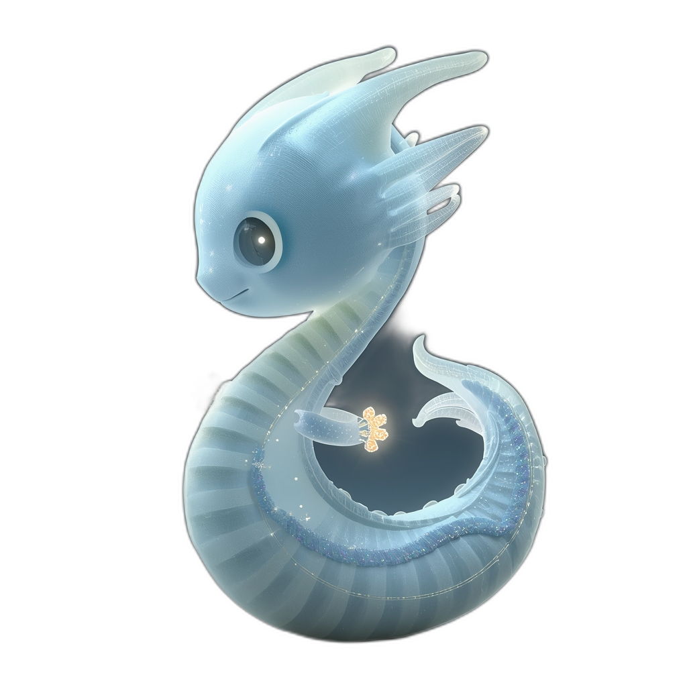
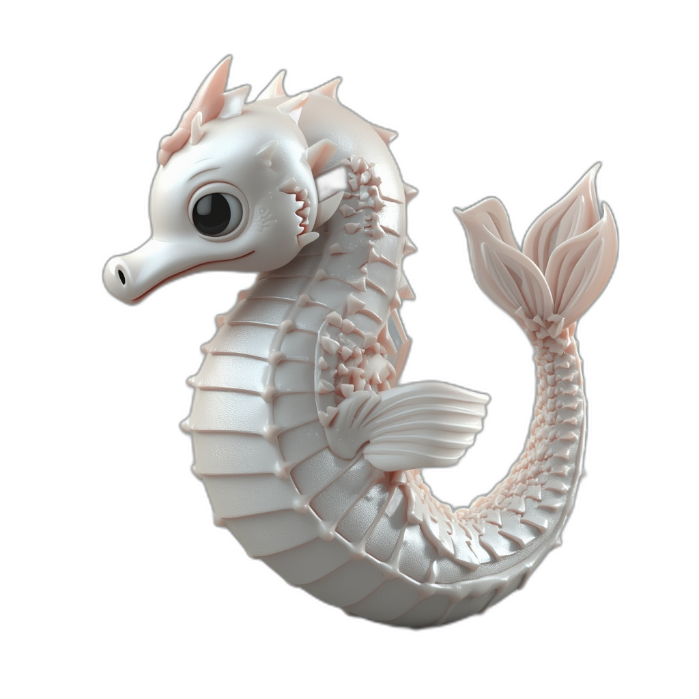
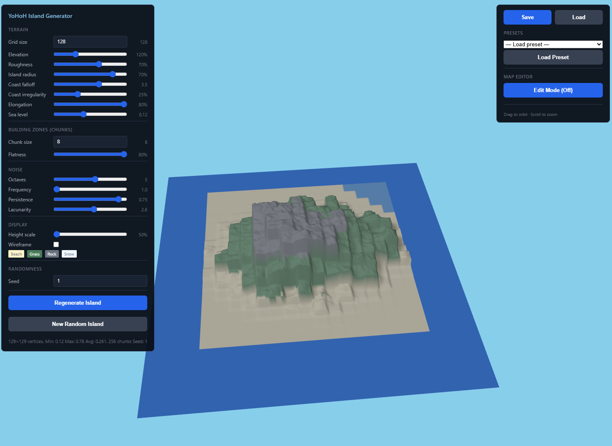
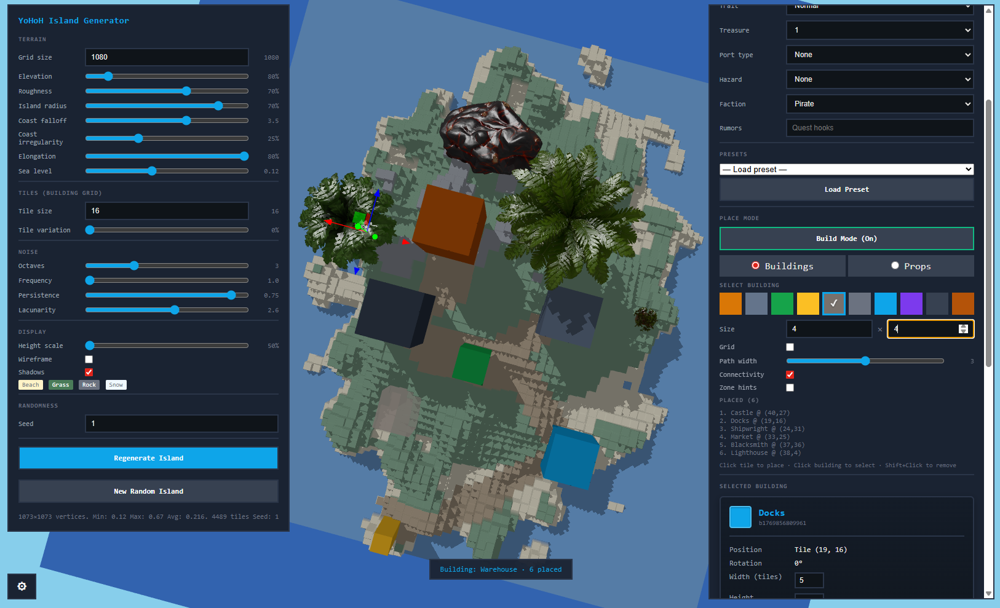

# YoHoH — You Only Have One Hull

<p align="center">
  <strong>A browser-based pirate adventure prototype</strong><br>
  Top-down sailing • Trading • Naval combat
</p>

<p align="center">
  
  
  
</p>

<p align="center">
  
  
  
</p>

<p align="center">
  <strong><a href="https://itzmorphinetime.github.io/YoHoH/">View Presentation GDD →</a></strong>
</p>

---

## Overview

**YoHoH** is a small indie prototype for a pirate adventure game set in **The Shattered Seas**—a fractured archipelago where old empires drowned and five Pirate Kings rose from the wreckage. Sail a procedurally generated archipelago, trade goods between islands, fight naval battles, and manage your crew. Built with **Three.js** for top-down 2.5D rendering in the browser.

> *See [LORE.md](LORE.md) for the full world backstory and the Five Pirate Kings.*  
> *See the [Presentation GDD](https://itzmorphinetime.github.io/YoHoH/) for a visual presentation (GitHub Pages).*  
> *See [docs/STORYBOOK.html](docs/STORYBOOK.html) for in-depth lore on each Pirate King (click to open modals).*  
> *Presentation King cards have a 📖 button to view lore. Run `npm run extract-lore` after updating LORE.md to refresh presentation data.*  
> *The presentation includes an interactive **3D Models** slide—click any model card to preview in 3D (drag to rotate, scroll to zoom, view presets).*

- **Procedural map** — Center-out planar graph; islands and routes generated from a seed
- **Distance = danger/reward** — Islands farther from Home offer higher risk and reward
- **Trading loop** — Buy low, sell high; prices vary by island
- **Naval combat** — Broadside cannons, hull/sails/crew damage, bilge and leaks
- **Crew & ships** — Hire sailors, assign stations, choose ship class (Sloop, Brigantine, Galleon)

---

## Features

### World & Navigation
- **Procedurally generated archipelago** — Delaunay-based planar graph; 8–12 islands (configurable)
- **Overworld map** — Click routes to sail; hover for destination info (distance, danger, port type)
- **Chart Screen (M)** — Strategic map overlay with pan, zoom, island labels, legend, compass rose
- **Minimap** — North indicator, sailing progress bar, route context
- **Save/Load maps** — Ctrl+S / Ctrl+O; export/import JSON
- **Onboarding hints** — First-time tips; dismissible, persisted
- **UI scaling** — Settings modal: 75%–150% slider; persisted via localStorage

### Sailing
- **3D sailing corridor** — Ship constrained to route; origin/destination markers
- **WASD control** — Thrust, brake, turn; momentum and drift
- **Random encounters** — Combat can trigger while sailing
- **Damage persistence** — Hull, sails, bilge, leaks carry over
- **Arrival feedback** — Toast "Arrived at [Island]!" when reaching destination

### Naval Combat
- **Broadside cannons** — Q (port) / E (starboard); aim-then-fire with arc preview
- **Damage model** — Hull HP, sails (speed), crew effectiveness; hull damage → leaks → bilge water
- **2 enemy types** — Trader (flees) and Raider (aggressive)
- **Loot** — Gold and salvage on victory

### Port & Economy
- **Market** — Buy/sell 8 goods (Rum, Timber, Cloth, Iron, Powder, Cannon Parts, Spices, Pearls)
- **Island-specific prices** — Base + bias + variance; distance from Home affects prices
- **Cargo system** — Capacity per ship class; unit sizes per good
- **Dock fees** — Gold deducted on port entry (configurable economy sink)
- **Shipwright** — Repair hull, sails, leaks for gold; change ship class; ship comparison table
- **Tavern (Crew Management)** — Hire crew; station overview (fill status); assign/dismiss; roster with station dropdown

### Ships & Crew
- **3 ship classes** — Sloop (agile, 20 cargo), Brigantine (balanced, 40 cargo), Galleon (tough, 60 cargo)
- **Ship comparison** — Side-by-side stats table in Shipwright (Hull, Sails, Crew, Cargo, Turn rate, Speed, Slots)
- **Station slots** — Variable per class; e.g. Galleon has 3 gunner slots, 2 carpenter slots
- **Station effects** — Turn rate, reload speed, sail speed, bilge pump, hull repair
- **Carpenter repair** — Assigned carpenters repair hull and stop leaks over time (sailing/combat)

<p align="center">
  
  
  
  
</p>

---

## The Shattered Seas

Sail the fractured archipelago where five Pirate Kings hold dominion. Your mission: **rescue the last of the dragons** from those who hunt them.

<p align="center">
  
  
  
  
  
</p>

<p align="center">
  <em>The Five Pirate Kings — Ghost Captain, Sea Serpent, Leviathan Queen, Kraken Caller, Dragon Marauder</em>
</p>

<p align="center">
  
  
  
  
  
</p>

<p align="center">
  <em>Rescue the dragons. Defy the Kings.</em>
</p>


<p align="center">
  
  
  
  
  
</p>

<p align="center">
  <em>Find Familiars / Pets along the way.</em>
</p>
---

## Controls

### Overworld
| Input | Action |
|-------|--------|
| **Click route** | Select route; click "Set Sail" to travel |
| **Click island** | Enter port (when docked) |
| **M** | Open/close Chart Screen |
| **Mouse drag** | Pan overworld map |
| **Scroll** | Zoom overworld map |
| **Ctrl+S** | Save map (JSON) |
| **Ctrl+O** | Load map |

### Sailing
| Input | Action |
|-------|--------|
| **W / S** | Thrust forward / brake |
| **A / D** | Turn port / starboard |
| **M** | Open/close Chart Screen |
| **Esc** | — |

### Combat
| Input | Action |
|-------|--------|
| **WASD** | Sail / maneuver |
| **Q** | Aim port cannons (first press) → Fire (second press) |
| **E** | Aim starboard cannons (first press) → Fire (second press) |
| **R** | Restart combat (after victory/defeat) |
| **Esc** | Return to map (after victory/defeat) |

### Port
| Input | Action |
|-------|--------|
| **Click tabs** | Tavern, Shipwright, Market |
| **Escape** | Leave port |

### Settings
| Input | Action |
|-------|--------|
| **⚙ button** | Open Settings modal (UI scale 75%–150%) |

---

## Quick Start

### Main Game

```bash
cd Demo
npm install
npm run dev
```

Open **http://localhost:5173**

### Standalone POCs

Two proof-of-concept tools for procedural content:

| POC | Description | Run |
|-----|-------------|-----|
| **[Map Generator](map-generator-poc/)** | Procedural archipelago — Delaunay planar graph, island nodes, routes, pirate data, editor | `cd map-generator-poc && npm install && npm run dev` |
| **[Island Generator](island-generator-poc/)** | Procedural island terrain — Simplex noise, building placement, island properties, automatic paths | `cd island-generator-poc && npm install && npm run dev` |

**Map Generator** — Center-out planar graph; islands and routes; edit mode (add/remove nodes, routes); Save/Load JSON. See [IMPLEMENTATION_PLAN.md](IMPLEMENTATION_PLAN.md) §5.

**Island Generator** — 3D terrain with Simplex noise; beach/grass/rock/snow elevation colors; tile-based building placement (Tavern, Shipwright, Market, Lighthouse, Warehouse, Fort, Docks, Dragon Sanctuary); **island properties** (name, description, trait, treasure, port type, hazard, faction, rumors); **building selection** — click building to select, properties panel with Rotate/Remove; **cargo size** from building dimensions; **automatic paths** (Prim's MST + A*, terrain smoothing, path color, path width 1–5); **docks over water**; **props & decorations** (BerryBush, OakTree, PalmTree, Rock); brush elevation editing; Save/Load with full schema; example JSON presets. See [island-generator-poc/ISLAND_GENERATOR.md](island-generator-poc/ISLAND_GENERATOR.md) for the full plan and improvement suggestions.
<p align="center">
  
  
</p>
<p align="center">
  
  
</p>

---

## Roadmap

| Phase | Status | Focus |
|-------|--------|-------|
| **0** | ✅ Done | Foundation — project, renderer, game loop |
| **1** | ✅ Done | Map Generator POC — procedural archipelago, editor |
| **A** | ✅ Done | Fun First Combat — ship handling, cannons, 2 enemy types, loot |
| **B** | ✅ Done | Trading Loop — overworld, travel, Chart Screen, market, repairs, dock fees |
| **B.5** | 🔄 In progress | Core gameplay polish — sailing feel, arrival toast, UI scaling ✓ |
| **C** | 🔄 Partial | Crew + Upgrades — hire/assign ✓, ship classes ✓, comparison UI ✓; upgrades, Infamy gates pending |
| **D** | 🔄 Partial | Vertical Slice — 8–12 islands ✓; contracts, Lieutenant boss, save/load pending |
| **Polish** | ⏳ Planned | Effects, particles, audio, accessibility |

### Upcoming
- **Phase C:** Ship upgrades (6–8 slots), ship class purchase, Infamy progression, cannon count per class
- **Phase D:** Contracts (delivery, smuggling, salvage), ship naming, enemy ship classes, save/load
- **Polish:** Muzzle flash, impact splash, wake trails, water ripples, boarding resolution

---

## Project Structure

```
Demo/
├── index.html              # Main game entry
├── package.json
├── vite.config.js
├── Images/                 # Art assets (Pirate Kings, dragons, ships, islands, maps, props, items)
├── 3D_Models/              # 3D assets (FBX) — dragons, items, props, pirate kings
├── docs/                   # Presentation GDD (GitHub Pages), 3D viewer, STORYBOOK
├── src/
│   ├── main.js             # Bootstrap
│   ├── config.js           # Centralized config (WORLD, CAMERA, COMBAT, ECONOMY, UI, etc.)
│   ├── Game.js             # Game loop, state machine
│   ├── Renderer.js         # Three.js orthographic renderer
│   ├── Input.js            # Keyboard + mouse
│   ├── map/                # MapGenerator (Delaunay planar graph)
│   ├── render/             # RenderConfig (per-view config)
│   ├── entities/           # Ship, Sloop, Brigantine, Galleon, Enemy, Projectile
│   ├── systems/            # SailingSystem, CombatSystem, EconomySystem, CrewSystem
│   ├── scenes/             # OverworldScene, CombatScene, PortScene
│   └── ui/                 # HUD, MapUI, BigMapUI, Minimap, PortUI
├── public/data/
│   └── goods.json          # 8 trade goods
├── scripts/
│   └── extract-lore.js     # Parse LORE.md → pirate-kings-lore.json for presentation
├── map-generator-poc/       # Standalone archipelago map editor (Delaunay, routes)
├── island-generator-poc/    # Island terrain (noise, buildings, island properties, paths, Save/Load)
└── IMPLEMENTATION_PLAN.md   # Detailed design doc
```

---

## Tech Stack

| Layer | Technology |
|-------|------------|
| Rendering | Three.js (r160+), orthographic camera |
| UI | HTML/CSS + DOM |
| State | Vanilla JavaScript (ES6+ modules) |
| Build | Vite |
| Map | d3-delaunay (planar graph) |

---

## License

MIT (or as specified in the repository)
